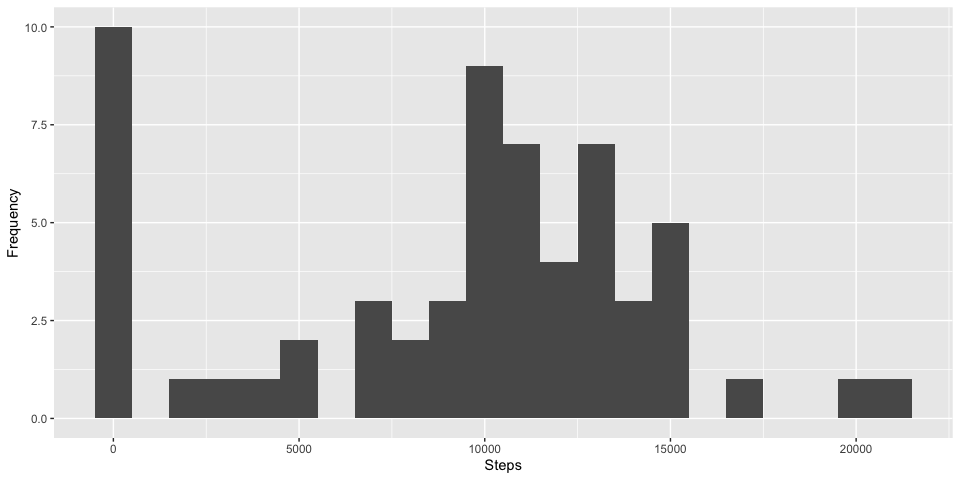
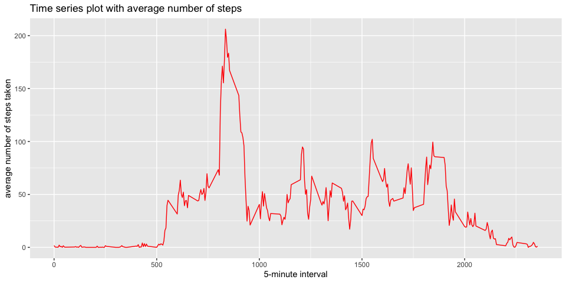
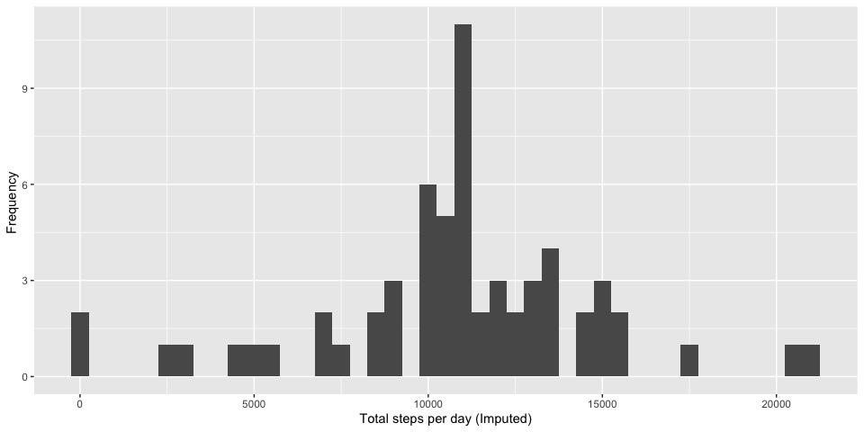
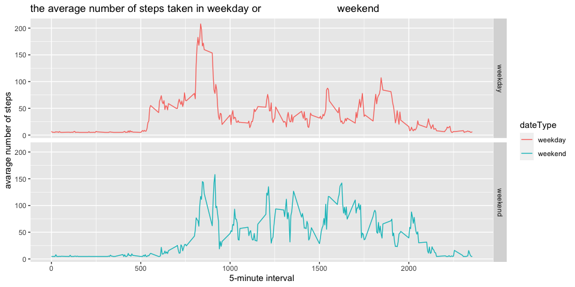

## Loading and preprocessing the data


```r
unzip("./activity.zip")
Activity <-read.csv("./activity.csv")
Activity$date <- as.Date(as.character(Activity$date))
Missing_activity <- is.na(Activity$steps)
```


## What is mean total number of steps taken per day?
  ### Total number of steps taken per day
  ### Histogram
  ### Mean and dedian ofthe total number of steps taken per day


```r
Totalsum <- tapply(Activity$steps, Activity$date, sum, na.rm=TRUE)
qplot(Totalsum, binwidth = 1000, xlab = "Steps", ylab = "Frequency")
```

<!-- -->

```r
mean(Totalsum, na.rm=TRUE)
```

```
## [1] 9354.23
```

```r
median(Totalsum, na.rm=TRUE)
```

```
## [1] 10395
```
## What is the average daily activity pattern?
   ### Make a time series plot (x = the 5-minute interval, y=average          number of steps taken, averaged across all days
   
   ### Which 5-minute interval, on average across all the days in the        dataset, contains the maximum number of steps?
  

```r
Averages <- aggregate(x = list(Activity$steps), by = list(Activity$interval), 
                      FUN= mean, na.rm = TRUE)
names(Averages) <- c("intervals", "steps")

ggplot(Averages, aes(x = intervals, y = steps)) + 
  geom_line(color="red") + 
  xlab("5-minute interval") + 
  ylab("average number of steps taken")+
  ggtitle("Time series plot with average number of steps")
```

<!-- -->

```r
maxsteps <-Averages[which.max(Averages$steps), ]
print(maxsteps)
```

```
##     intervals    steps
## 104       835 206.1698
```
  
## Imputing missing values
   #### Count number missing value and make new data set filled 
   in the missing value

   ### Histogram and calculate mean and median
`

```r
#install.packages("Hmisc")
library(Hmisc)
```

```
## Loading required package: lattice
```

```
## Loading required package: survival
```

```
## Loading required package: Formula
```

```
## 
## Attaching package: 'Hmisc'
```

```
## The following objects are masked from 'package:dplyr':
## 
##     src, summarize
```

```
## The following objects are masked from 'package:base':
## 
##     format.pval, units
```

```r
sum(Missing_activity)
```

```
## [1] 2304
```

```r
Activity2 <-Activity
Activity2$steps <- impute(Activity$steps, fun=mean)
Summary <- tapply(Activity2$steps, Activity2$date, sum)

qplot(Summary, xlab="Total steps per day (Imputed)", ylab="Frequency ", binwidth=500)
```

<!-- -->

```r
mean(Summary)
```

```
## [1] 10766.19
```

```r
median(Summary)
```

```
## [1] 10766.19
```
  *What is the impact of imputing missing data on the estimates of the       total daily number of steps?  : Adding average in missing value          elevated total mean. And missing value were 2304 among 17568         obs.,that means this portion is big, so mean and median exactly same*


## Are there differences in activity patterns between weekdays and weekends?
   ### Dataset with two levels – “weekday” and “weekend” 
   ### Make a panel plot containing a time series plot , averaged across        all weekday days or weekend days.
   

```r
getDate <- function(arg_date) {
  ifelse(as.POSIXlt(arg_date)$wday %in% c(0,6), "weekend", "weekday") 
}

Activity2$dateType <- as.factor(getDate(Activity2$date))


Averages_data <- aggregate(steps ~ interval + dateType, data = Activity2, FUN=mean)


x <- ggplot(Averages_data, aes(interval, steps, color=dateType))+
            geom_line() + 
            facet_grid(dateType ~ .) +
            xlab("5-minute interval") + 
            ylab("avarage number of steps")+
            ggtitle("the average number of steps taken in weekday or                          weekend")
print(x)
```

<!-- -->


